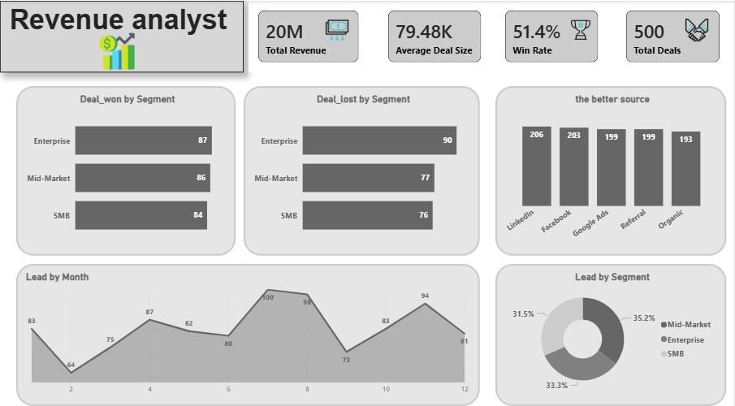
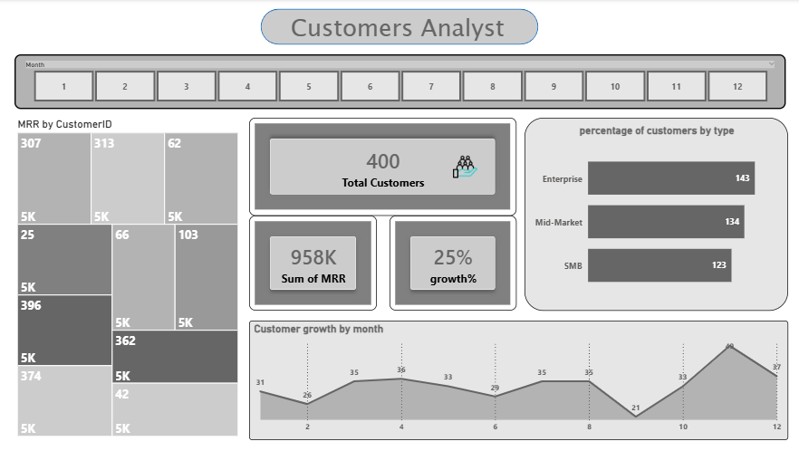

# Revenue-Operation-Analyst-CRM-B2B-
data analysis project using powerbi to explore market sales 
## Data source :
from kaggel 
## Tools used :
 powerbi using Power_Query and Dax
## Project Question : 
How can Revenue Operations insights be used to evaluate sales performance, analyze customer behavior, optimize the sales funnel, and forecast future revenue?
## Explore data :
the data contains 1001 rows and 20 columns 
## Clean data :
1. Removed columns that were not relevant to the analysis objectives.

2. Removed all duplicate records, if any were found.

3. Verified that the dataset contained no missing values.

4. Checked the dataset for any data inconsistencies or errors.

5. Removed unnecessary leading and trailing spaces (trimmed text) and converted all text values to uppercase to ensure consistency and avoid matching errors.

6. The dataset is now clean and ready for analysis.
## data analysis :
                                                           Dashboard1(revenue analyst)
                      

Revenue Performance Overview

- The company generated a total revenue of $20 million across all deals.
- The average deal size was $79.48K, indicating a strong contribution from high-value B2B transactions.
- The overall win rate was 51.4%, meaning that more than half of the sales opportunities were successfully converted into customers.
- The dataset included a total of 500 deals, providing a comprehensive view of sales performance and revenue generation.

Deal Performance by Customer Segment

- The Enterprise segment achieved the highest number of won deals with 87 successful opportunities, followed closely by the Mid-Market segment with 86 wins and SMB with 84 wins.
- In terms of lost deals, the Enterprise segment recorded the highest number of losses with 90 lost opportunities, compared to 77 for Mid-Market and 76 for SMB.
- Although Enterprise customers generate significant revenue opportunities, the higher number of lost deals indicates the need for improving conversion strategies and sales engagement within this segment.

Lead Source Performance Analysis

- LinkedIn was the top-performing lead source with 206 leads, followed by Facebook with 203 leads.
- Google Ads and Referral channels generated 199 leads each, while Organic traffic generated 193 leads.
- The results show that social media channels, especially LinkedIn, are strong contributors to lead generation in the B2B sales process.

Lead Distribution by Customer Segment

- Lead distribution was relatively balanced across segments:
  - Mid-Market generated the highest share of leads at 35%.
  - Enterprise accounted for 33% of leads.
  - SMB contributed 31% of total leads.
- The balanced distribution indicates that the company is attracting opportunities across different customer segments rather than relying on a single market category.

Monthly Lead Generation Trends

- Lead generation remained relatively stable throughout the year, with some fluctuations between months.
- The highest number of leads was recorded in Month 7 with 100 leads, followed by Month 8 with 98 leads and Month 11 with 94 leads.
- The lowest lead volume occurred in Month 2 with 64 leads.
- The increase in leads during the middle and later months suggests potential seasonal effects or improved marketing and sales activities.

                                                      Dashboard1(revenue analyst)
                      

Customer Base Overview

- The company has a total customer base of 400 customers.
- The total Monthly Recurring Revenue (MRR) generated from customers is $958K, highlighting a strong recurring revenue model.
- The customer base experienced an overall growth rate of 25%, indicating positive business expansion and customer acquisition performance.

Customer Distribution by Segment

- The customer distribution is relatively balanced across different segments:
  - Enterprise customers represent the largest segment with 143 customers.
  - Mid-Market customers account for 134 customers.
  - SMB customers represent 123 customers.
- The balanced customer mix shows that the company has successfully diversified its customer portfolio across different market segments.

Customer Growth Trends Over Time

- Customer acquisition remained consistent throughout the year with some fluctuations across months.
- The highest customer growth was recorded in Month 11 with 49 new customers, followed by Month 4 with 36 customers and Month 12 with 37 customers.
- The lowest growth occurred in Month 9 with 21 new customers.
- The increase in customer growth during the final months indicates improved acquisition performance and potential impact from sales and marketing activities.

MRR Contribution Analysis

- The top 10 customers each generated an MRR of $5K, indicating a consistent contribution among the highest-value customers.
- The equal MRR contribution from top customers suggests a balanced revenue distribution and reduces dependency on a small number of accounts.
- Identifying and retaining high-value customers is essential for maintaining recurring revenue growth.

Business Recommendations

- Continue focusing on customer acquisition strategies that contributed to the strong growth rate of 25%.
- Analyze the characteristics of Enterprise and Mid-Market customers to identify opportunities for upselling and expansion.
- Develop customer retention strategies to protect recurring revenue and maximize customer lifetime value (CLV).
- Monitor high-value accounts regularly to identify expansion opportunities and reduce churn risk.

Business Recommendations

- Focus on improving the Enterprise conversion rate due to the high number of lost deals despite strong revenue potential.
- Continue investing in LinkedIn and other high-performing acquisition channels to maintain lead generation efficiency.
- Analyze successful Enterprise and Mid-Market deals to identify patterns that can improve future sales strategies.
- Use historical pipeline data to refine revenue forecasting and improve sales planning.
